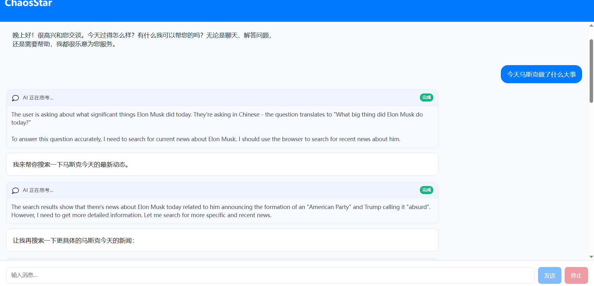

# ChaosStar

A lightweight agent framework designed for deep research and high-quality content generation, based on OpenManus architecture.

## 🚀 Features

- **ReAct Agent Architecture**: Implements "Think-Act-Reflect" structure with step-by-step reasoning
- **Multi-step Tool Calling**: Supports sequential tool invocation with continuous output optimization
- **Interleaved Thinking Support**: Extended thinking with tool use designed for stream request for Anthropic API
- **Optimized Transport**: Memory-based transmission mechanism reducing client-server overhead
- **Extensible Design**: Framework supports expansion to multi-agent systems

## 🎬 Demo Video



*Watch the picture showcasing the agent in action during two request mode.*

## 🏗️ Architecture

### Backend
- **Framework**: FastAPI
- **Agent Pattern**: ReAct (Reasoning + Acting)
- **Transport**: Custom memory-based transmission (or stdio)
- **API Support**: OpenAI(not yet) & Anthropic interfaces

### Frontend
- **Framework**: React
- **Output**: Single-shot results display
- **In Progress**: Streaming output capabilities

## 🚀 Getting Started

### Prerequisites
Configure your API key in `config/config.example.test.toml`
For non-USA regions: Proxy configuration should be also set for AsyncClient connections to OpenAI and Anthropic

### Local Setup
```bash
# Backend setup
cd web/backend
pip install -r requirements.txt
playwright install

# Start backend
python main.py

# Frontend setup (new terminal)
cd web/frontend
npm install

# Start frontend
npm run dev
```

## 🛳️ Docker Deployment

### Directory Layout
Ensure the directory structure is as follows：
```
ChaosStar/
├── docker/
│   ├── backend.Dockerfile
│   ├── frontend.Dockerfile
│   └── nginx.conf
├── docker-compose.yml
├── .env.example       ← define VITE_API_BASE_URL
└── web/
    ├── backend/
    └── frontend/
    └── shared/
```

### Build & Run
1. Copy and edit your .env：  
   ```bash
   # Copy .env.example to .env under root directory
   cp .env.example .env
   # Edit .env
   # VITE_API_BASE_URL=http://backend:8000
   ```
2. Build and launch under root directory:  
   ```bash
   docker-compose up --build
   ```
3. Browse：  
   - Frontend(Prod)：http://localhost:80 
   - Backend API：    http://localhost:8000  

### Development Mode
If you want to run Vite Dev Server in a container, it supports HMR and can be executed：  
```bash
docker-compose up frontend-dev
```

## 🧩 Extensibility

ChaosStar is a foundation you can grow into:

### 🔧 **Custom Workflows**
Define your own "Think → Act" pipelines for research, data extraction, chatbots, etc.

### 🛠️ **Tool Plugins**
Drop in new tools (e.g. web scrapers, calculators, custom APIs) under `app/tools/`.

> Whether you're building a chat assistant, research companion, or domain‑specific agent, ChaosStar's modular core makes it straightforward.

## 🤝 Contributing

Contributions welcome!

## 📄 License

MIT License - see LICENSE file for details.
